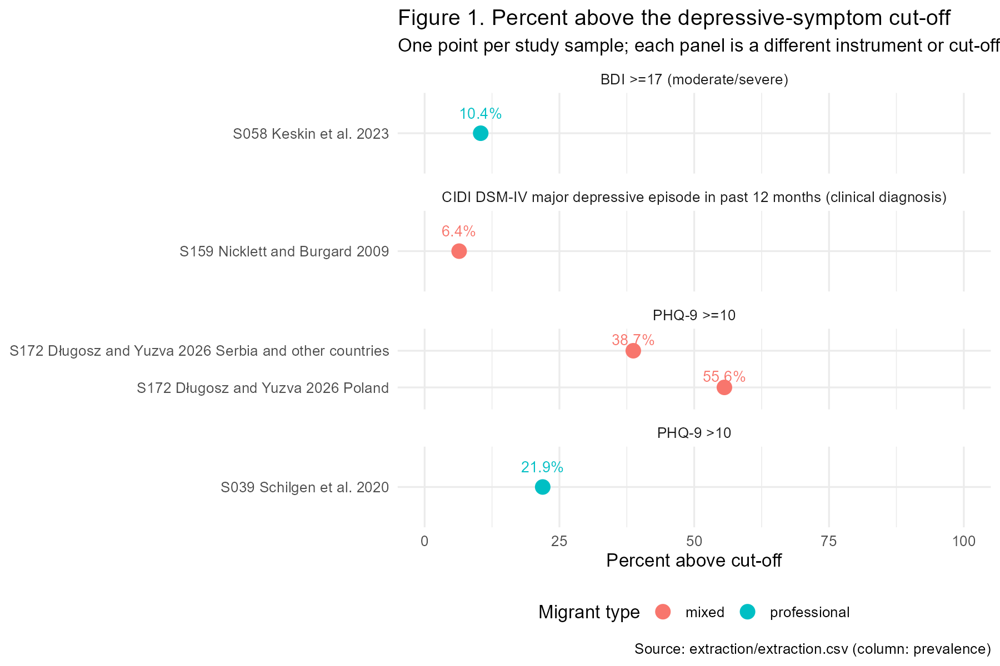
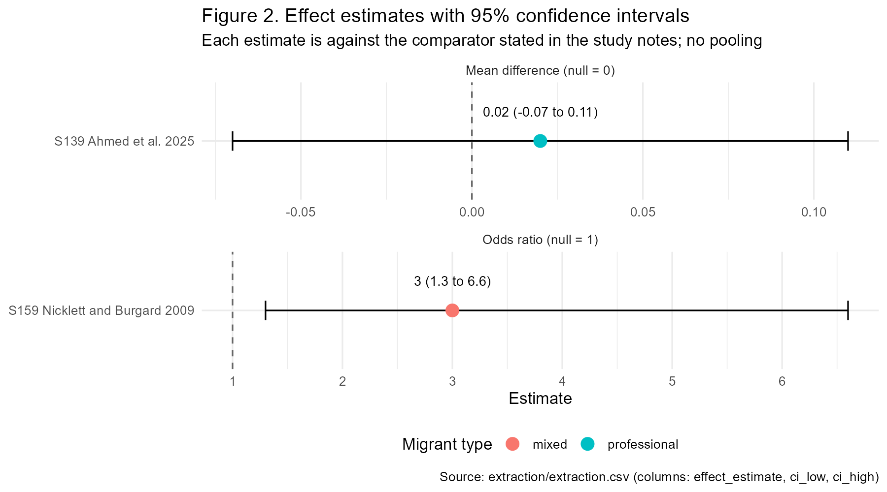
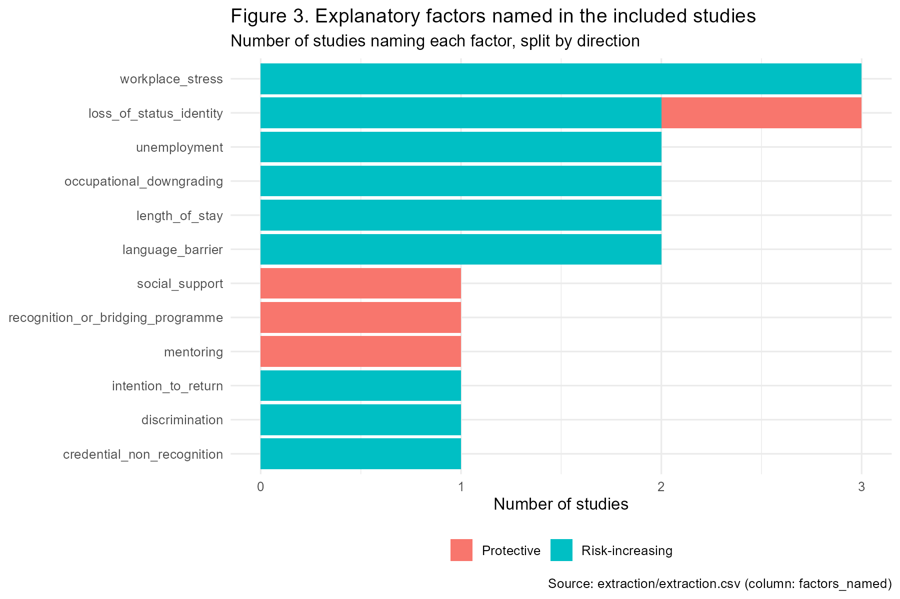

# Do skilled professionals who migrate and restart their careers show more depressive symptoms than recent graduates who migrate before establishing a career? A rapid review

**Draft v0.1, 2026-09-12. PubMed only. PsycINFO, Google Scholar and citation chasing not yet run. One included record (S090) still awaiting full text.**

Reviewer and author: Dr. Okpara Onyedikachi Martins (MBBS, Nigeria; MSc Global Health, University of Bonn), for PYROS (PyNexus research channel).
Drafting and analysis support: Claude (Anthropic), under the rules in `CLAUDE.md`. All study selection, data verification and conclusions are the reviewer's.

Every number in this report traces to a row in `extraction/extraction.csv` or `extraction/quality.csv`, identified by study ID (S###). Tables and figures are generated by `analysis/run_analysis.R`.

---

## Key messages

1. **No published study we found directly compares established professionals with recent graduates who migrated.** The question this review set out to answer has not been tested in the literature retrieved from PubMed.
2. **Skilled migrants who are working in their profession do not show more depressive symptoms than local colleagues.** Two nurse studies in Germany and Finland found no difference from native-born nurses (S039, S075), and among Korean immigrants in Toronto, professionals had the lowest symptom scores of four occupational groups (S107).
3. **Losing status or working below one's qualification is where the risk appears.** Immigrants in the United States who fell three or more rungs in perceived social standing had three times the odds of a major depressive episode (S159). Among forced migrants, the group with far more people working below their qualifications had a higher proportion above the PHQ-9 cut-off (S172).
4. **Getting professionals back into their field may help general mental health.** A six-month placement as assistant teachers for health-trained migrants in Norway improved general mental health and well-being, though not the anxiety-depression score, in a small pilot (S139).
5. The evidence is thin: seven studies, none designed for this question, most cross-sectional, with different scales and cut-offs. Findings are descriptive and no pooling was done.

---

## 1. Background

Skilled migrants often cannot practise their original profession in the destination country. Foreign qualifications may not be recognised, licensing can take years, and many take jobs below their training level. This is described as deskilling, overqualification, brain waste or occupational downgrading.

The idea behind this review is that a professional who has already built a career, identity and income, and then loses them on migration, may be at greater risk of depressive symptoms than a recent graduate who migrates before those things exist and who may see migration as the start of a career rather than an interruption.

Sourced statements are still needed on: (a) the size of skilled migration flows, (b) rates of deskilling among skilled migrants, (c) the association between migration and depressive symptoms, and (d) the role of occupational status in mental health. Each is `TODO-VERIFY` until a confirmed source is placed in `search/`.

## 2. Review question

**Primary.** Among adult international migrants with tertiary qualifications, do those who migrated as established professionals and had to restart their careers show higher levels of depressive symptoms than those who migrated as recent graduates before establishing a career?

**Secondary.** (1) What is the prevalence, or mean scale score, of depressive symptoms in each migrant type? (2) Which explanatory factors do studies name? (3) Which factors are linked to better outcomes, and what supports do studies report?

**Hypothesis H1.** Established-professional migrants have higher depressive-symptom scores or prevalence than recent-graduate migrants. The review reports all three possible findings for every comparison: supports H1, contradicts H1, or no difference.

## 3. Methods (summary)

The full protocol (v0.2, approved 2026-09-12) is in `protocol/protocol.md`.

- **Design.** Rapid review: single reviewer with AI-assisted drafting; no second human reviewer; no protocol registration.
- **Eligibility.** Adults (18+); international migrants with tertiary qualifications, or a study reporting them as a subgroup; depressive symptoms measured with a validated scale or a clinical diagnosis; quantitative or mixed-methods designs (qualitative studies for secondary questions only); any country; published 2000 onwards; English. Exclusions: internal migrants, second-generation only, current students only, forced-migrant samples with no measure of prior profession, no validated depressive-symptom measure, reviews and commentaries.
- **Migrant types.** *Professional*: worked 2 or more years in the qualified field before migration, or described as experiencing career restart, re-licensing or downgrading. *Recent graduate*: qualified 2 years or less before migration with no established career. *Mixed*: sample not separable.
- **Search.** PubMed, run 2026-09-12 (`search/search_strategy.md`, `search/search_log.csv`); 215 records. PsycINFO and Google Scholar searches, grey literature and citation chasing are planned but not yet run.
- **Screening.** Title and abstract, then full text, with the exclusion criterion recorded for every excluded record (`screening/screening_log.csv`).
- **Extraction.** One row per study per migrant group (`extraction/extraction.csv`); every value verified by the reviewer against the PDF page.
- **Quality.** Five yes/no/unclear items (`extraction/quality.csv`): sampling representative; validated measure; migrant type clear; response rate 50% or higher; adjustment for age, sex and length of stay.
- **Synthesis.** Narrative. Prevalence is reported within each scale and cut-off; mean scores are never compared across scales; no meta-analysis (fewer than three comparable studies).

## 4. Study flow

| Stage | Records |
|---|---|
| Identified (PubMed, 2026-09-12) | 215 |
| Screened at title and abstract | 215 |
| Excluded at title and abstract | 200 |
| Sought for full text | 15 |
| Full text not yet obtained (S090, paywalled) | 1 |
| Assessed at full text | 14 |
| Excluded at full text | 7 |
| Included in the quantitative synthesis | 7 studies (8 data rows; S172 reports two samples) |
| Qualitative studies retained for secondary questions only | 2 (S117, S199) |

Full-text exclusions with reasons: S009 (no estimate for the migrant subgroup), S016 (measured before migration), S068 (refugee sample without prior-profession measure; professionals only in focus groups), S117 and S199 (qualitative, no validated measure), S135 (peripartum sample selected on a screening score), S138 (no depressive-symptom measure).

## 5. Included studies

**Table 1. Characteristics of included studies.** Quality flags Q1 to Q5 as defined in section 3 (Y yes, N no, ? unclear).

| study_id | authors | year | country | design | sample_size | migrant_type | measure | quality_flags |
|---|---|---|---|---|---|---|---|---|
| S039 | Schilgen et al. | 2020 | Germany | cross_sectional | 105 | professional | PHQ-9 >10 | ?/Y/?/N/N |
| S058 | Keskin et al. | 2023 | Turkey | cross_sectional | 570 | professional | BDI >=17 (moderate/severe) | ?/Y/Y/Y/N |
| S075 | Wesołowska et al. | 2018 | Finland | cross_sectional | 209 | professional | GHQ-12 anxiety/depression 4 items (1-4 scale; not full scale) | ?/?/?/N/N |
| S107 | Kim et al. | 2019 | Canada | cross_sectional | 258 | professional | CES-D 16-item (range 0-48; no cut-off used) | N/Y/Y/?/? |
| S139 | Ahmed et al. | 2025 | Norway | intervention | 21 | professional | HSCL-10 anxiety/depression (standardised 0-1; raw >=1.85 clinical) | N/Y/Y/?/Y |
| S159 | Nicklett and Burgard | 2009 | United States | cross_sectional | 3056 | mixed | CIDI DSM-IV major depressive episode in past 12 months (clinical diagnosis) | Y/Y/N/Y/Y |
| S172 | Długosz and Yuzva | 2026 | Poland | cross_sectional | 200 | mixed | PHQ-9 >=10 | N/Y/?/?/N |
| S172 | Długosz and Yuzva | 2026 | Serbia and other countries | cross_sectional | 164 | mixed | PHQ-9 >=10 | N/Y/?/?/N |

None of the seven studies enrolled recent graduates as a group. Five rows are classified *professional* and three *mixed*. Classification as professional was inferred from sample descriptions for S039 and S075 (licensed nurses, years of experience not reported) and is stated in the notes column of `extraction.csv`.

## 6. Results

### 6.1 Primary question: professionals versus recent graduates

No included study compared established professionals with recent graduates. The direction tally against H1 is therefore: supports H1, 0; contradicts H1, 0; no difference, 0. What each study did compare is shown below.

| study_id | migrant_type | comparator | finding |
|---|---|---|---|
| S039 | professional | native-born nurses | no difference |
| S058 | professional | none | no comparator |
| S075 | professional | native-born nurses | no difference |
| S107 | professional | other immigrant occupational groups | professionals lower than comparator |
| S139 | professional | control group (before-after) | no difference |
| S159 | mixed | immigrants with no change in social status | more symptoms with status loss or underemployment |
| S172 | mixed | the other forced-migrant sample | more symptoms with status loss or underemployment |
| S172 | mixed | the other forced-migrant sample | more symptoms with status loss or underemployment |

### 6.2 Depressive symptoms by migrant type (secondary question 1)

**Table 2. Findings by migrant type.** Mean scores are on different scales and must not be compared across rows. Effect estimates are of different types (see notes in `extraction.csv`).

| study_id | authors | year | migrant_type | measure | prevalence | mean_score | effect_estimate | ci_95 | direction_text |
|---|---|---|---|---|---|---|---|---|---|
| S159 | Nicklett and Burgard | 2009 | mixed | CIDI DSM-IV major depressive episode in past 12 months (clinical diagnosis) | 6.4 |  | 3 | 1.3 to 6.6 | supports the status-loss pathway |
| S172 | Długosz and Yuzva | 2026 | mixed | PHQ-9 >=10 | 55.6 | 11.15 |  |  | high symptoms with heavy underemployment |
| S172 | Długosz and Yuzva | 2026 | mixed | PHQ-9 >=10 | 38.7 | 9.24 |  |  | qualification mismatch linked to more symptoms |
| S039 | Schilgen et al. | 2020 | professional | PHQ-9 >10 | 21.9 | 6.86 |  |  | no difference |
| S058 | Keskin et al. | 2023 | professional | BDI >=17 (moderate/severe) | 10.4 |  |  |  |  |
| S075 | Wesołowska et al. | 2018 | professional | GHQ-12 anxiety/depression 4 items (1-4 scale; not full scale) |  | 1.99 |  |  | no difference |
| S107 | Kim et al. | 2019 | professional | CES-D 16-item (range 0-48; no cut-off used) |  | 5.07 |  |  | professionals lowest of the four groups |
| S139 | Ahmed et al. | 2025 | professional | HSCL-10 anxiety/depression (standardised 0-1; raw >=1.85 clinical) |  | 0.28 | 0.02 | -0.07 to 0.11 | no change in anxiety/depression score; general mental health and well-being improved |

**Figure 1.** Percent above the depressive-symptom cut-off, one point per study sample. Each panel is a different instrument or cut-off, so values are not comparable across panels.

*Professional migrants.* Among immigrant homecare nurses in Hamburg (S039), 21.9% scored above the PHQ-9 cut-off compared with 21.4% of non-immigrant nurses; mean scores were 6.86 and 6.67 (no difference). Among foreign-born nurses in Finland (S075), distress on four GHQ-12 anxiety and depression items averaged 1.99 against 1.92 for native nurses (no difference). Among Korean immigrant workers in Toronto (S107), professionals had a mean 16-item CES-D score of 5.07, the lowest of four occupational groups (microbusiness owners 6.37, non-manual 5.65, manual 7.38). Among 570 Syrian refugee physicians in Turkey (S058), 10.4% had a Beck Depression Inventory score in the moderate or severe range (17 or above); the median score was 7. In the Norwegian pilot (S139), the standardised anxiety-depression score of health-trained migrants without accreditation was 0.28 at baseline and 0.25 after six months.

*Mixed samples.* Among 3,056 first-generation Latino and Asian immigrants in the United States (S159), 6.4% had a major depressive episode in the past year by structured clinical interview. Among forced migrants (S172), 55.6% of Ukrainian women in Poland and 38.7% of Russian migrants (mostly in Serbia) scored 10 or above on the PHQ-9; mean scores were 11.15 and 9.24. In these samples 73.6% and 88% respectively had higher education, but only 26.8% of the Ukrainian sample was working in a job matching their qualifications, against 69.8% of the Russian sample.

### 6.3 Effect estimates

**Figure 2.** Effect estimates with 95% confidence intervals, each against the comparator stated in the study. No pooled estimate is drawn.

Two studies report an effect estimate. In S159, immigrants whose perceived social standing fell by three or more rungs after migration had an adjusted odds ratio of 3.0 (95% CI 1.3 to 6.6) for a past-year major depressive episode, compared with those whose standing did not change; a fall of two rungs gave an odds ratio of 1.9 (0.9 to 3.9). In S139, the adjusted difference-in-differences for the anxiety-depression score was 0.02 (95% CI -0.07 to 0.11), that is, no change attributable to the placement, although general mental health (GHQ-12) improved by -0.07 (-0.11 to -0.02) and well-being improved.

### 6.4 Explanatory factors (secondary question 2)

**Figure 3.** Number of included studies naming each factor, split by whether the study reported it as risk-increasing or protective.

| factor | role | n_studies |
|---|---|---|
| credential_non_recognition | Risk-increasing | 1 |
| discrimination | Risk-increasing | 1 |
| intention_to_return | Risk-increasing | 1 |
| language_barrier | Risk-increasing | 2 |
| length_of_stay | Risk-increasing | 2 |
| loss_of_status_identity | Protective | 1 |
| loss_of_status_identity | Risk-increasing | 2 |
| mentoring | Protective | 1 |
| occupational_downgrading | Risk-increasing | 2 |
| recognition_or_bridging_programme | Protective | 1 |
| social_support | Protective | 1 |
| unemployment | Risk-increasing | 2 |
| workplace_stress | Risk-increasing | 3 |

Loss of status or identity and workplace stress were each named by three studies. Loss of status was risk-increasing in S159 and S139 and protective in reverse in S058, where physicians who kept a strong physician identity, rather than a refugee identity, were described as doing better. Unemployment, occupational downgrading, language barriers and length of stay were each named by two studies. In S172, negative attitudes of the host population were the strongest predictor of PHQ-9 score in the Ukrainian sample, and working below qualification predicted higher scores in the Russian sample. In S058, planning to return to Syria and lacking primary-care experience went with higher BDI scores. In S107, language barriers and long working hours predicted higher CES-D scores.

*Qualitative studies (secondary questions only; not in the quantitative tables).* Twenty Syrian doctors seeking a medical licence in Germany (S117) described a long, opaque and changing licensing process, loss of professional status, and unpaid internships that were hard to obtain; they used the words depressed, irritated and in despair. Twenty-three highly educated Iranians in the United States (S199), most of them doctoral students, described visa uncertainty and years of enforced family separation, with reports of depression, insomnia and panic. Neither study measured depressive symptoms with a scale.

### 6.5 Protective factors and supports (secondary question 3)

- **Work placement with mentoring (S139).** Six months as assistant teachers in university health programmes, with a mentor from the same profession, improved general mental health and well-being in health-trained migrants awaiting accreditation. Anxiety-depression scores did not change. Participants described renewed confidence, family pride and less stress. Non-randomised pilot, 21 participants.
- **Good working relationships (S039).** Good relationships with colleagues and superiors were protective against distress among homecare nurses; fixed-term contracts and low influence at work went the other way.
- **Retained professional identity (S058).** Refugee physicians who saw themselves as physicians first were described as doing better; all had completed an adaptation training programme.
- **Acceptance by the host population and matched employment (S172).** Positive local attitudes and work matching qualifications went with fewer symptoms.

## 7. Quality of the included studies

| study_id | q1_sampling_representative | q2_validated_measure | q3_migrant_type_clear | q4_response_rate_ge50 | q5_adjusted_age_sex_stay |
|---|---|---|---|---|---|
| S039 | unclear | yes | unclear | no | no |
| S058 | unclear | yes | yes | yes | no |
| S075 | unclear | unclear | unclear | no | no |
| S107 | no | yes | yes | unclear | unclear |
| S139 | no | yes | yes | unclear | yes |
| S159 | yes | yes | no | yes | yes |
| S172 | no | yes | unclear | unclear | no |

Only S159 met four of the five items. Response rates were below 50% or unclear in five studies. Only S159 and S139 adjusted for age, sex and length of stay. Migrant type was inferred rather than stated in S039, S075 and S172. S075 used four items of the GHQ-12 rather than a full depressive-symptom scale, and S139 used a combined anxiety-depression scale.

## 8. Interpretation

**Both directions of the evidence are reported (rule 4).**

*Evidence that professionals who are practising are not worse off.* Three studies (S039, S075, S107) found immigrant professionals no worse than, or better than, their comparators. All three sampled people already licensed or employed in their field or another job, so they describe professionals who had, at least partly, re-established themselves.

*Evidence that status loss and underemployment carry risk.* S159 shows a dose-like pattern: the larger the fall in perceived standing, the higher the odds of a depressive episode, independent of education, income and time in the country. S172 shows the sample with far more qualification mismatch also had a higher proportion above the cut-off, though the two samples differ in sex, host country and war exposure, so the comparison is confounded. S139 and the qualitative studies (S117, S199) describe the waiting period before re-entry into the profession as the hardest.

*What this means for the hypothesis.* The retrieved studies cannot test whether established professionals fare worse than recent graduates. They are consistent with a narrower statement: the risk is concentrated in the period when a skilled migrant is not working at their level, and it eases once they are. Whether recent graduates experience that period differently remains untested.

## 9. Limitations

- Single reviewer with AI assistance; no second human screener or extractor.
- PubMed only so far; PsycINFO, Google Scholar, grey literature and citation chasing are still to be run, and the PubMed yield (215 records) may be incomplete.
- One record (S090) could not yet be retrieved.
- No study reported the two migrant types as groups; classification was inferred and is recorded as such.
- Brief quality appraisal, not a full risk-of-bias tool.
- Different scales and cut-offs prevent pooling; findings are descriptive.
- Most studies are cross-sectional, so direction of cause cannot be established.
- English-language only; no author contact.

## 10. Recommendations supported by the included studies

Each recommendation states only what the studies support.

1. **Shorten the time between arrival and working at one's level.** Downward social mobility (S159) and qualification mismatch (S172) were associated with more depressive symptoms; the waiting period for licensing was described as the most distressing phase (S117, S139).
2. **Offer structured placements with same-profession mentors while accreditation is pending.** In one small pilot (S139) this improved general mental health and well-being. Effects on depressive symptoms specifically were not shown, and a randomised trial is needed.
3. **Support good working relationships and job security for migrant health workers.** Colleague and supervisor relationships were protective and fixed-term contracts were not (S039).
4. **Support professional identity during transition.** Physicians who kept a strong professional identity were described as doing better (S058).
5. **Address host-community attitudes.** Negative local attitudes were the strongest predictor of symptoms in one forced-migrant sample (S172).

**Lived-experience advice.** *To be added by Dr. Okpara and labelled as such. Not part of the evidence synthesis.*

## 11. Data and code

- `extraction/extraction.csv`, `extraction/quality.csv`: all extracted values with page references.
- `screening/screening_log.csv`: every screening decision with its criterion.
- `analysis/run_analysis.R`: regenerates Tables 1 and 2, the direction tally and Figures 1 to 3.
- `search/`: search strings, log and the PubMed export.

## 12. References (included and retained studies; all verified in `search/pubmed_2026-09-12.txt`)

- S039. Schilgen et al. (2020). The extent of psychosocial distress among immigrant and non-immigrant homecare nurses: a comparative cross sectional survey. *Int J Environ Res Public Health*. PMID 32138277.
- S058. Keskin et al. (2023). Quality of life and psychometric characteristics of Syrian refugee physicians who migrated to Turkey: a cross-sectional study. *Int J Clin Pract*. PMID 38094991.
- S075. Wesołowska et al. (2018). The association between cross-cultural competence and well-being among registered native and foreign-born nurses in Finland. *PLoS One*. PMID 30532137.
- S107. Kim et al. (2019). Microbusinesses and occupational stress: emotional demands, job resources, and depression among Korean immigrant microbusiness owners in Toronto, Canada. *J Prev Med Public Health*. PMID 31588699.
- S139. Ahmed et al. (2025). Changes in health after a work-related intervention among highly educated migrants in Norway: a pilot study. *BMC Public Health*. PMID 41174618.
- S159. Nicklett and Burgard (2009). Downward social mobility and major depressive episodes among Latino and Asian-American immigrants to the United States. *Am J Epidemiol*. PMID 19671834.
- S172. Długosz and Yuzva (2026). The prevalence of mental health disorders and stress coping strategies among forced migrants from Ukraine and Russia. *Sci Rep*. PMID 41946888.
- S117 (qualitative, secondary questions only). Loss et al. (2020). 'Wait and wait, that is the only thing they can say': a qualitative study exploring experiences of immigrated Syrian doctors applying for medical license in Germany. *BMC Health Serv Res*. PMID 32321507.
- S199 (qualitative, secondary questions only). Taridashti et al. (2026). Health impacts of restrictive migration policies: a qualitative study of highly educated Iranian immigrants and international students in the U.S. *J Immigr Minor Health*. PMID 40790105.

Background sources for section 1: `TODO-VERIFY` (none yet placed in `search/`).
